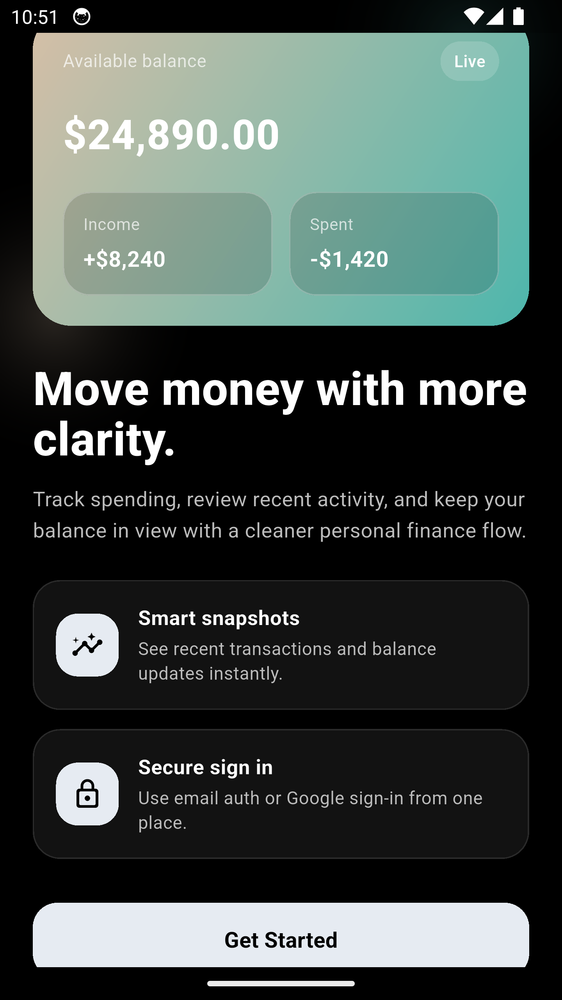
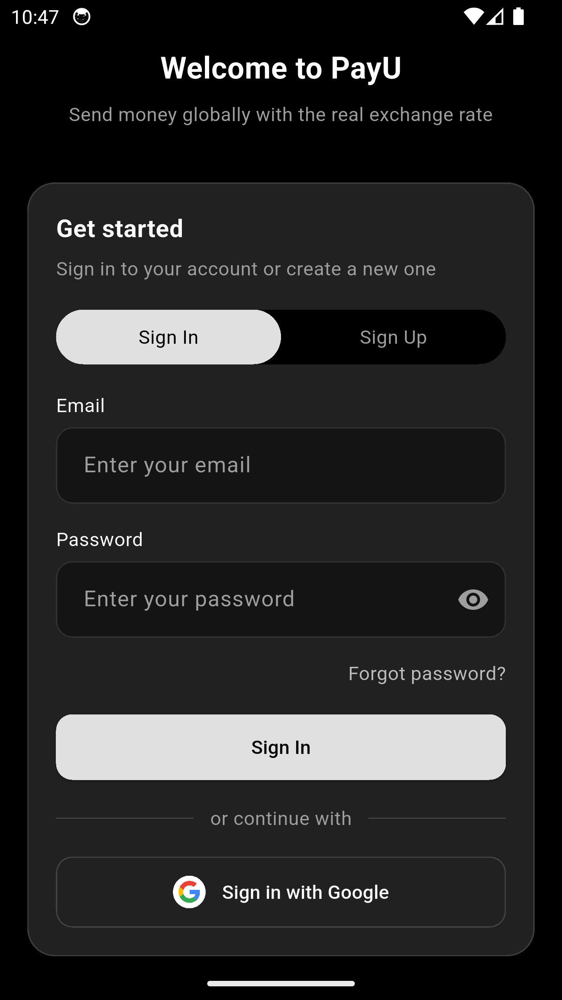
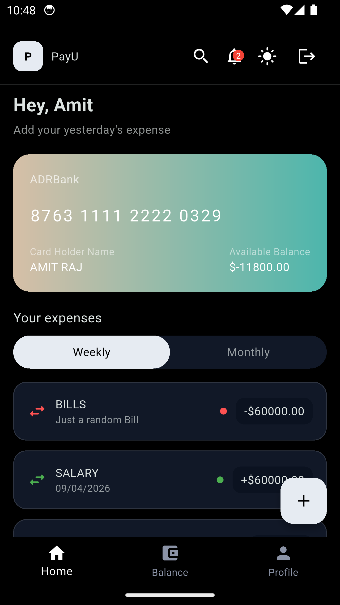
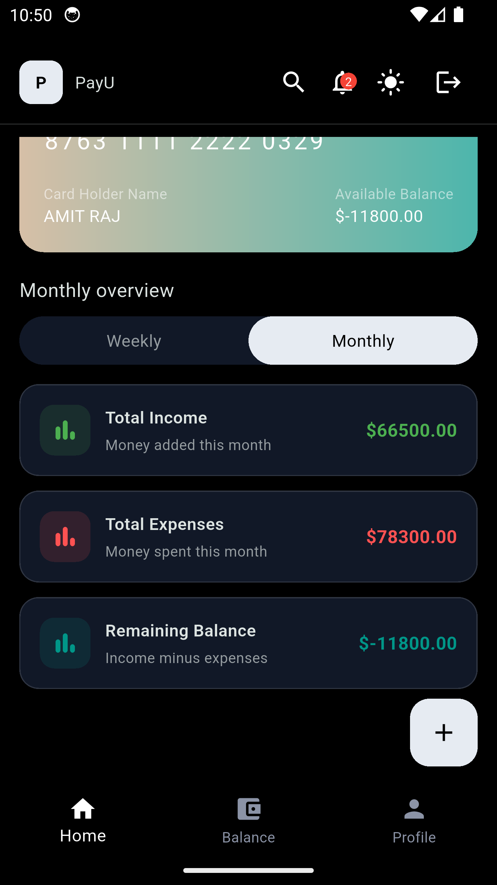
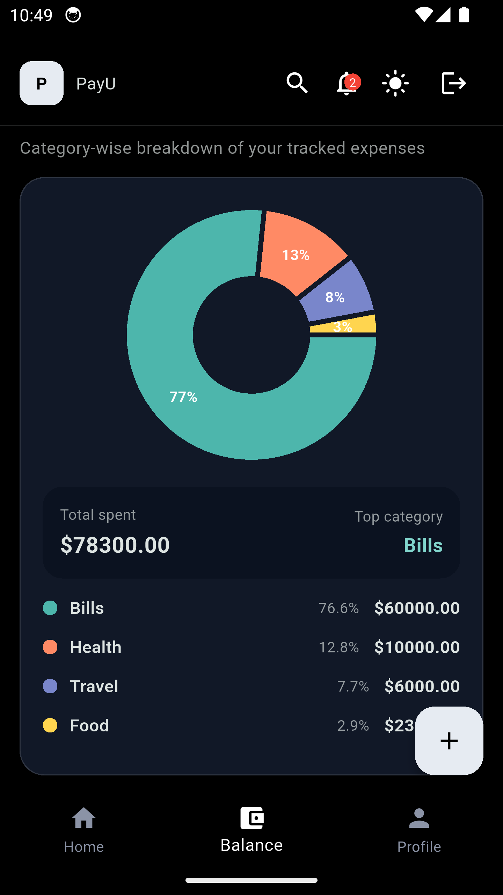
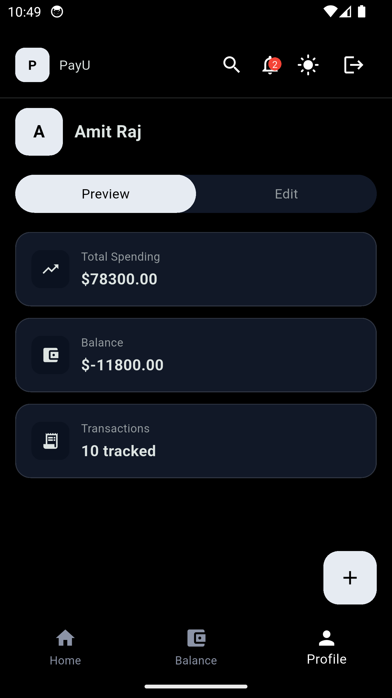
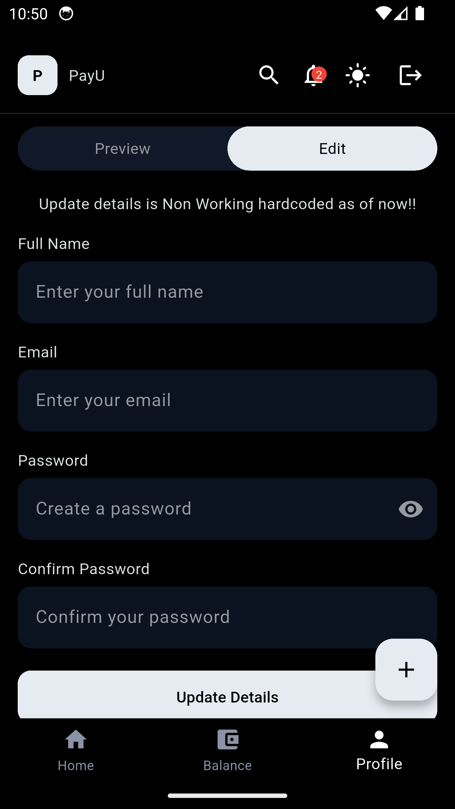

# Fin Track

Fin Track is a Flutter expense tracker with a fintech-style UI, Firebase authentication, local transaction storage with Hive, and a multi-screen dashboard for daily money tracking.

## Features

- Using multiProvider as an effective state management across screens 
- Fintech style UI with new get started screen
- Email/password authentication with Firebase Auth
- Google sign-in support
- Automatic auth session restore on app launch
- Sign out from the top bar
- Home dashboard with recent transactions and balance summary
- Balance screen with category breakdown and charts
- Profile screen with signed-in user details
- Add income and expense entries from a bottom sheet
- Local transaction persistence using Hive
- Light and dark theme toggle
- Category-based transaction organization

## Tech Stack

- Flutter
- Provider
- Firebase Auth
- Google Sign-In
- Hive
- fl_chart
- country_flags

## Project Structure

```text
lib/
  main.dart
  models/
    sign_in/
    transaction/
  screens/
    balance_screen/
    get_started_screen/
    home_screen/
    login_screen/
    profile_screen/
  utils/
    main_navigation_screen/
    theme/
    transaction_sheet/
  widgets/
```

## Setup

### 1. Prerequisites

- Flutter SDK 3.x
- Dart SDK
- Android Studio or VS Code
- A Firebase project configured for Android and/or iOS

### 2. Clone the project

```bash
git clone <your-repo-url>
cd Fin_track
```

### 3. Install dependencies

```bash
flutter pub get
```

### 4. Configure Firebase

This app uses `firebase_core`, `firebase_auth`, and `google_sign_in`.

Set up Firebase for every platform you want to run:

- Create a Firebase project
- Add your Android app and/or iOS app
- Enable `Email/Password` in Firebase Authentication
- Enable `Google` in Firebase Authentication
- Add the required platform config files:
  - Android: `android/app/google-services.json`
  - iOS: `ios/Runner/GoogleService-Info.plist`

If you use Firebase CLI + FlutterFire, you can also generate configuration with:

```bash
flutterfire configure
```

If you generate `firebase_options.dart`, update `main.dart` to initialize Firebase with that file if needed for your setup.

### 5. Configure Google Sign-In

Make sure Google Sign-In is enabled in Firebase Auth and the app SHA fingerprints / bundle identifiers are configured correctly in Firebase.

For Android, verify:

- package name matches the Firebase app
- SHA-1 and SHA-256 keys are added in Firebase console

For iOS, verify:

- bundle identifier matches the Firebase app
- URL types and reversed client ID are configured correctly

### 6. Run the app

```bash
flutter run
```

## Implemented Screens

### Get Started

- Intro screen with branding and CTA into login

### Login / Sign Up

- Email sign-in
- Email sign-up
- Google sign-in
- Keyboard-safe form layout

### Home

- Personalized greeting using the signed-in user name
- Recent transaction list
- Weekly/monthly view toggle
- Balance card

### Balance

- Net balance overview
- Expense category breakdown
- Visual chart section
- Currency card

### Profile

- Signed-in user name display
- Preview and edit layout
- Personal finance summary cards


## Screenshots

### Authentication

<p align="center">
  
  
</p>

### Main App

<p align="center">
  
  
  
  
  
</p>

## Authentication Flow

- App starts through an auth gate in `main.dart`
- If a Firebase user session exists, the app opens the main navigation flow
- If not, it opens the login screen
- Google users and email users both route into the same authenticated app flow

## Local Storage

Transactions are stored locally with Hive in `transactions_box`.

Stored transaction fields:

- `id`
- `amount`
- `isExpense`
- `category`
- `date`
- `note`

## Current Dependencies

From `pubspec.yaml`:

- `provider`
- `hive`
- `hive_flutter`
- `intl`
- `google_sign_in`
- `flutter_svg`
- `firebase_core`
- `firebase_auth`
- `fl_chart`
- `country_flags`

## Notes

- Firebase must be configured before authentication will work.
- Google sign-in requires proper Firebase and platform setup.
- Hive storage initializes at app startup through `TransactionController`.

## Future Improvements

- Edit and delete transactions
- Cloud sync / Firestore support
- Better profile editing flow
- Export reports
- Budget goals and alerts
- Proper screenshot assets in the repository
